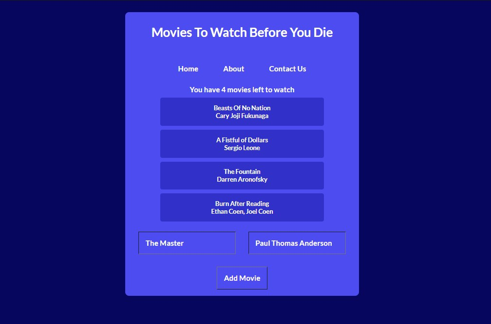

# Movies To Watch Before You Die

## React app utilising useState, useEffect, useContext, useReducer, local storage and Sass.

### The user is able to create their own list of movies to watch and can delete them easily as they go. The movies that are added are saved in local storage to be able to start where they had left off.

